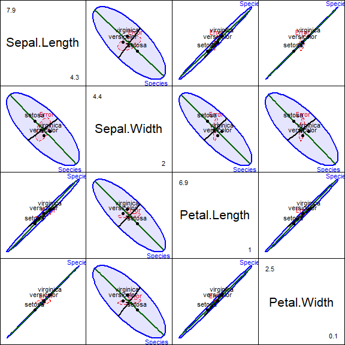
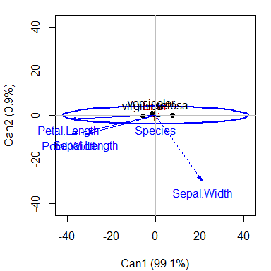
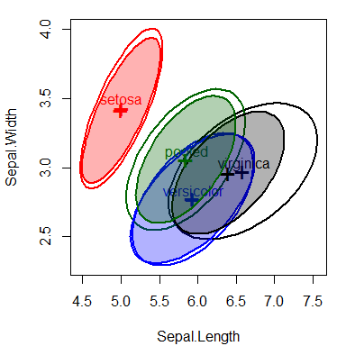

<!-- README.md is generated from README.Rmd. Please edit that file and knit again -->
<!-- badges: start -->

[](https://lifecycle.r-lib.org/articles/stages.html#stable)
[](http://cran.r-project.org/package=heplots)
[](https://friendly.r-universe.dev)
[](https://github.com/friendly/heplots)
[](https://cran.r-project.org/package=heplots)
[](https://zenodo.org/badge/latestdoi/13908453)
[](https://friendly.github.io/heplots)
<!-- badges: end -->

# heplots 

## **Visualizing Hypothesis Tests in Multivariate Linear Models**

<!-- Version 1.7.2 -->

Version 1.7.4

## Description

The `heplots` package provides functions for visualizing hypothesis
tests in multivariate linear models (“MLM” = {MANOVA, multivariate
multiple regression, MANCOVA, and repeated measures designs}). It also
provides other tools for analysis and graphical display of MLMs.

HE plots represent sums-of-squares-and-products matrices for linear
hypotheses (**H**) and for error (**E**) using ellipses (in two
dimensions), ellipsoids (in three dimensions), or by line segments in
one dimension. For the theory and applications, see:

- [Friendly (2007)](http://datavis.ca/papers/jcgs-heplots.pdf) for the
  basic theory on which this is based.
- [Fox, Friendly and Monette
  (2009)]((http://datavis.ca/palers/FoxFriendlyMonette-2009.pdf)) for a
  brief introduction,
- [Friendly (2010)](http://www.jstatsoft.org/v37/i04/paper) for the
  application of these ideas to repeated measure designs,
- [Friendly, Monette and Fox
  (2013)](http://datavis.ca/palers/ellipses-STS402.pdf) for a general
  discussion of the role of elliptical geometry in statistical
  understanding,
- [Friendly & Sigal (2017)](https://doi.org/10.20982/tqmp.13.1.p020) for
  an applied R tutorial,
- [Friendly & Sigal (2018)](https://www.datavis.ca/papers/EqCov-TAS.pdf)
  for theory and examples of visualizing equality of covariance
  matrices.

If you use this work in teaching or research, please cite it as given by
`citation("heplots")` or see [Citation](authors.html#citation).

Other topics now addressed here include:

- robust MLMs, using iteratively re-weighted least squared to
  down-weight observations with large multivariate residuals,
  `robmlm()`.
- `Mahalanobis()` calculates classical and *robust* Mahalanobis squared
  distances using MCD and MVE estimators of center and covariance.
- visualizing tests for equality of covariance matrices in MLMs (Box’s M
  test), `boxM()` and `plot.boxM()`. Also: `bartlettTests()` and
  `LeveneTests()` for homogeneity of variance for each response in a
  MLM.
- $\chi^2$ Q-Q plots for MLMs (`cqplot()`) to detect outliers and assess
  multivariate normality of residuals.
- bivariate coefficient plots showing elliptical confidence regions
  (`coefplot()`).

In this respect, the `heplots` package now aims to provide a wide range
of tools for analyzing and visualizing multivariate response linear
models, together with other packages:

<a href="https://friendly.github.io/candisc/"></a>

- The related [`candisc`](https://friendly.github.io/candisc/) package
  provides HE plots in **canonical discriminant** space, the space of
  linear combinations of the responses that show the maximum possible
  effects and for canonical correlation in multivariate regression
  designs. See the [package
  documentation](https://friendly.github.io/candisc/) for details.

<a href="https://friendly.github.io/mvinfluence/"></a>

- Another package,
  [`mvinfluence`](https://friendly.github.io/mvinfluence/), provides
  diagnostic measures and plots for **influential observations** in MLM
  designs. See the [package
  documentation](https://friendly.github.io/mvinfluence/) for details.

Several tutorial vignettes are also included. See
`vignette(package="heplots")`.

## Installation

|  |  |
|----|----|
| CRAN version | `install.packages("heplots")` |
| R-universe | `install.packages("heplots", repos = c('https://friendly.r-universe.dev')` |
| Development version | `remotes::install_github("friendly/heplots")` |

## HE plot functions

The graphical functions contained here all display multivariate model
effects in variable (**data**) space, for one or more response variables
(or contrasts among response variables in repeated measures designs).

- `heplot()` constructs two-dimensional HE plots for model terms and
  linear hypotheses for pairs of response variables in multivariate
  linear models.

- `heplot3d()` constructs analogous 3D plots for triples of response
  variables.

- The `pairs` method, `pairs.mlm()` constructs a scatterplot matrix of
  pairwise HE plots.

- `heplot1d()` constructs 1-dimensional analogs of HE plots for model
  terms and linear hypotheses for single response variables.

## Other functions

- `glance.mlm()` extends `broom::glance.lm()` to multivariate response
  models, giving a one-line statistical summary for each response
  variable. `uniStats()` does something similar, but formatted more like
  a ANOVA table.

- `boxM()` Calculates Box’s *M* test for homogeneity of covariance
  matrices in a MANOVA design. A `plot` method displays a visual
  representation of the components of the test. Associated with this,
  `bartletTests()` and `levineTests()` give the univariate tests of
  homogeneity of variance for each response measure in a MLM.

- `covEllipses()` draw covariance (data) ellipses for one or more group,
  optionally including the ellipse for the pooled within-group
  covariance. `coefplot()` for an MLM object draws bivariate confidence
  ellipses.

### Repeated measure designs

For repeated measure designs, between-subject effects and within-subject
effects must be plotted separately, because the error terms (**E**
matrices) differ. For terms involving within-subject effects, these
functions carry out a linear transformation of the matrix **Y** of
responses to a matrix **Y M**, where **M** is the model matrix for a
term in the intra-subject design and produce plots of the **H** and
**E** matrices in this transformed space. The vignette `"repeated"`
describes these graphical methods for repeated measures designs. (This
paper [HE plots for repeated measures
designs](http://www.jstatsoft.org/v37/i04/paper) is now provided as a
PDF vignette.)

## Datasets

The package also provides a large collection of data sets illustrating a
variety of multivariate linear models of the types listed above,
together with graphical displays. The table below classifies these with
method tags. Their names are linked to their documentation with
graphical output on the `pkgdown` website,
\[<http://friendly.github.io/heplots>\].

| dataset | rows | cols | title | tags |
|----|----|----|----|----|
| [AddHealth](http://friendly.github.io/heplots/reference/AddHealth.html) | 4344 | 3 | Adolescent Health Data | MANOVA ordered |
| [Adopted](http://friendly.github.io/heplots/reference/Adopted.html) | 62 | 6 | Adopted Children | MMRA repeated |
| [Bees](http://friendly.github.io/heplots/reference/Bees.html) | 246 | 6 | Captive and maltreated bees | MANOVA |
| [Diabetes](http://friendly.github.io/heplots/reference/Diabetes.html) | 145 | 6 | Diabetes Dataset | MANOVA |
| [dogfood](http://friendly.github.io/heplots/reference/dogfood.html) | 16 | 3 | Dogfood Preferences | MANOVA contrasts candisc |
| [FootHead](http://friendly.github.io/heplots/reference/FootHead.html) | 90 | 7 | Head measurements of football players | MANOVA contrasts |
| [Headache](http://friendly.github.io/heplots/reference/Headache.html) | 98 | 6 | Treatment of Headache Sufferers for Sensitivity to Noise | MANOVA repeated |
| [Hernior](http://friendly.github.io/heplots/reference/Hernior.html) | 32 | 9 | Recovery from Elective Herniorrhaphy | MMRA candisc |
| [Iwasaki_Big_Five](http://friendly.github.io/heplots/reference/Iwasaki_Big_Five.html) | 203 | 7 | Personality Traits of Cultural Groups | MANOVA |
| [mathscore](http://friendly.github.io/heplots/reference/mathscore.html) | 12 | 3 | Math scores for basic math and word problems | MANOVA |
| [MockJury](http://friendly.github.io/heplots/reference/MockJury.html) | 114 | 17 | Effects Of Physical Attractiveness Upon Mock Jury Decisions | MANOVA candisc |
| [NeuroCog](http://friendly.github.io/heplots/reference/NeuroCog.html) | 242 | 10 | Neurocognitive Measures in Psychiatric Groups | MANOVA candisc |
| [NLSY](http://friendly.github.io/heplots/reference/NLSY.html) | 243 | 6 | National Longitudinal Survey of Youth Data | MMRA |
| [oral](http://friendly.github.io/heplots/reference/oral.html) | 56 | 5 | Effect of Delay in Oral Practice in Second Language Learning | MANOVA |
| [Oslo](http://friendly.github.io/heplots/reference/Oslo.html) | 332 | 14 | Oslo Transect Subset Data | MANOVA candisc |
| [Overdose](http://friendly.github.io/heplots/reference/Overdose.html) | 17 | 7 | Overdose of Amitriptyline | MMRA cancor |
| [Parenting](http://friendly.github.io/heplots/reference/Parenting.html) | 60 | 4 | Father Parenting Competence | MANOVA contrasts |
| [peng](http://friendly.github.io/heplots/reference/peng.html) | 333 | 8 | Size measurements for adult foraging penguins near Palmer Station | MANOVA |
| [Plastic](http://friendly.github.io/heplots/reference/Plastic.html) | 20 | 5 | Plastic Film Data | MANOVA |
| [Pottery2](http://friendly.github.io/heplots/reference/Pottery2.html) | 48 | 12 | Chemical Analysis of Romano-British Pottery | MANOVA candisc |
| [Probe](http://friendly.github.io/heplots/reference/Probe.html) | 11 | 5 | Response Speed in a Probe Experiment | MANOVA repeated |
| [RatWeight](http://friendly.github.io/heplots/reference/RatWeight.html) | 27 | 6 | Weight Gain in Rats Exposed to Thiouracil and Thyroxin | MANOVA repeated |
| [ReactTime](http://friendly.github.io/heplots/reference/ReactTime.html) | 10 | 6 | Reaction Time Data | repeated |
| [Rohwer](http://friendly.github.io/heplots/reference/Rohwer.html) | 69 | 10 | Rohwer Data Set | MMRA MANCOVA |
| [RootStock](http://friendly.github.io/heplots/reference/RootStock.html) | 48 | 5 | Growth of Apple Trees from Different Root Stocks | MANOVA contrasts |
| [Sake](http://friendly.github.io/heplots/reference/Sake.html) | 30 | 10 | Taste Ratings of Japanese Rice Wine (Sake) | MMRA |
| [schooldata](http://friendly.github.io/heplots/reference/schooldata.html) | 70 | 8 | School Data | MMRA robust |
| [Skulls](http://friendly.github.io/heplots/reference/Skulls.html) | 150 | 5 | Egyptian Skulls | MANOVA contrasts |
| [SocGrades](http://friendly.github.io/heplots/reference/SocGrades.html) | 40 | 10 | Grades in a Sociology Course | MANOVA candisc |
| [SocialCog](http://friendly.github.io/heplots/reference/SocialCog.html) | 139 | 5 | Social Cognitive Measures in Psychiatric Groups | MANOVA candisc |
| [TIPI](http://friendly.github.io/heplots/reference/TIPI.html) | 1799 | 16 | Data on the Ten Item Personality Inventory | MANOVA candisc |
| [VocabGrowth](http://friendly.github.io/heplots/reference/VocabGrowth.html) | 64 | 4 | Vocabulary growth data | repeated |
| [WeightLoss](http://friendly.github.io/heplots/reference/WeightLoss.html) | 34 | 7 | Weight Loss Data | repeated |

## Examples

This example illustrates HE plots using the classic `iris` data set. How
do the means of the flower variables differ by `Species`? This dataset
was the impetus for R. A. Fisher (1936) to propose a method of
discriminant analysis using data collected by Edgar Anderson (1928).
Though some may rightly deprecate Fisher for being a supporter of
eugenics, Anderson’s `iris` dataset should not be blamed.

A basic HE plot shows the **H** and **E** ellipses for the first two
response variables (here: `Sepal.Length` and `Sepal.Width`). The
multivariate test is significant (by Roy’s test) *iff* the **H** ellipse
projects *anywhere* outside the **E** ellipse.

The positions of the group means show how they differ on the two
response variables shown, and provide an interpretation of the
orientation of the **H** ellipse: it is long in the directions of
differences among the means.

``` r
iris.mod <- lm(cbind(Sepal.Length, Sepal.Width, Petal.Length, Petal.Width) ~ 
                 Species, data=iris)
heplot(iris.mod)
```

<div class="figure">


<p class="caption">
HE plot of sepal length and Sepal width for the iris data
</p>

</div>

### Contrasts

Contrasts or other linear hypotheses can be shown as well, and the
ellipses look better if they are filled. We create contrasts to test the
differences between `versacolor` and `virginca` and also between
`setosa` and the average of the other two. Each 1 df contrast plots as
degenerate 1D ellipse– a line.

Because these contrasts are orthogonal, they add to the total 2 df
effect of `Species`. Note how the first contrast, labeled `V:V`,
distinguishes the means of *versicolor* from *virginica*; the second
contrast, `S:VV` distinguishes `setosa` from the other two.

``` r
par(mar=c(4,4,1,1)+.1)
contrasts(iris$Species)<-matrix(c(0, -1, 1, 
                                  2, -1, -1), nrow=3, ncol=2)
contrasts(iris$Species)
#>            [,1] [,2]
#> setosa        0    2
#> versicolor   -1   -1
#> virginica     1   -1
iris.mod <- lm(cbind(Sepal.Length, Sepal.Width, Petal.Length, Petal.Width) ~ 
                 Species, data=iris)

hyp <- list("V:V"="Species1","S:VV"="Species2")
heplot(iris.mod, hypotheses=hyp, 
       fill=TRUE, fill.alpha=0.1)
```

<div class="figure">


<p class="caption">
HE plot of sepal length and Sepal width for the iris data, showing lines
reflecting two contrasts among iris species.
</p>

</div>

### All pairwise HE plots

All pairwise HE plots are produced using the `pairs()` method for MLM
objects.In the plot, note how the means of most pairs of variables are
very highly correlated, in the order Setosa \< Versicolor \< Virginica,
but this pattern doesn’t hold for relations with `Sepal.Width`.

``` r
pairs(iris.mod, hypotheses=hyp, hyp.labels=FALSE,
      fill=TRUE, fill.alpha=0.1)
```



### Canonical discriminant view

For more than two response variables, a multivariate effect can be
viewed more simply by projecting the data into canonical space — the
linear combinations of the responses which show the greatest differences
among the group means relative to within-group scatter. The computations
are performed with the [`candisc`](http://github.com/friendly/candisc)
package, which has an `heplot.candisc()` method.

``` r
library(candisc)
iris.can <- candisc(iris.mod) |> print()
#> 
#> Canonical Discriminant Analysis for Species:
#> 
#>    CanRsq Eigenvalue Difference  Percent Cumulative
#> 1 0.96987   32.19193     31.907 99.12126     99.121
#> 2 0.22203    0.28539     31.907  0.87874    100.000
#> 
#> Test of H0: The canonical correlations in the 
#> current row and all that follow are zero
#> 
#>   LR test stat approx F numDF denDF   Pr(> F)    
#> 1      0.02344  199.145     8   288 < 2.2e-16 ***
#> 2      0.77797   13.794     3   145 5.794e-08 ***
#> ---
#> Signif. codes:  0 '***' 0.001 '**' 0.01 '*' 0.05 '.' 0.1 ' ' 1
```

The HE plot in canonical space shows that the differences among species
are nearly entirely one-dimensional. The weights for the variables on
the first dimension show how `Sepal.Width` differs from the other size
variables.

``` r
# HE plot in canonical space
heplot(iris.can, var.pos = 1, scale = 40)
```



### Covariance ellipses

MANOVA relies on the assumption that within-group covariance matrices
are all equal. It is useful to visualize these in the space of some of
the predictors. `covEllipses()` provides this both for classical and
robust (`method="mve"`) estimates. The figure below shows these for the
three Iris species and the pooled covariance matrix, which is the same
as the **E** matrix used in MANOVA tests.

``` r
par(mar=c(4,4,1,1)+.1)
covEllipses(iris[,1:4], iris$Species)
covEllipses(iris[,1:4], iris$Species, 
            fill=TRUE, method="mve", add=TRUE, labels="")
```



## References

Anderson, E. (1928). The Problem of Species in the Northern Blue Flags,
Iris versicolor L. and Iris virginica L. *Annals of the Missouri
Botanical Garden*, **13**, 241–313.

Fisher, R. A. (1936). The Use of Multiple Measurements in Taxonomic
Problems. *Annals of Eugenics*, **8**, 379–388.

Friendly, M. (2006). [Data Ellipses, HE Plots and Reduced-Rank Displays
for Multivariate Linear Models: SAS Software and
Examples.](https://www.jstatsoft.org/article/view/v017i06) *Journal of
Statistical Software*, **17**, 1-42.

Friendly, M. (2007). [HE plots for Multivariate General Linear
Models](http://datavis.ca/papers/jcgs-heplots.pdf). *Journal of
Computational and Graphical Statistics*, **16**(2) 421-444.
[DOI](http://dx.doi.org/10.1198/106186007X208407).

Fox, J., Friendly, M. & Monette, G. (2009). [Visualizing hypothesis
tests in multivariate linear models: The heplots package for
R](http://datavis.ca/palers/FoxFriendlyMonette-2009.pdf) *Computational
Statistics*, **24**, 233-246.

Friendly, M. (2010). [HE plots for repeated measures
designs](http://www.jstatsoft.org/v37/i04/paper). *Journal of
Statistical Software*, **37**, 1–37.

Friendly, M.; Monette, G. & Fox, J. (2013). [Elliptical Insights:
Understanding Statistical Methods Through Elliptical
Geometry](http://datavis.ca/palers/ellipses-STS402.pdf) *Statistical
Science*, **28**, 1-39.

Friendly, M. & Sigal, M. (2017). [Graphical Methods for Multivariate
Linear Models in Psychological Research: An R
Tutorial.](https://doi.org/10.20982/tqmp.13.1.p020) *The Quantitative
Methods for Psychology*, **13**, 20-45.

Friendly, M. & Sigal, M. (2018): [Visualizing Tests for Equality of
Covariance Matrices](https://www.datavis.ca/papers/EqCov-TAS.pdf), *The
American Statistician*,
[DOI](https://doi.org/10.1080/00031305.2018.1497537)
