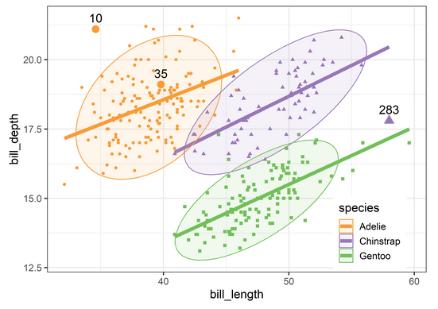

# ggplot2: Labeling noteworthy points in scatterplots (`geom_noteworthy`)

An important feature of many statistical plots is the ability to label "unusual" or "noteworthy"
observations such as those with large residuals, high leverage, or those outside a given confidence
envelope in a QQ plot. 

This feature is available, _automatically_, in the various plots produced by `plot.lm()` for a linear model,
using the `id.n` argument (default: `id.n = 3`) and the `labels.id` argument that supplies the labels
for the noteworthy points.

The function `showLabels` in the `car` package extends this considerably, providing a very general
utility for identifying noteworthy points and labeling them in plots. The `id.method` argument for
that function allows selection by Mahalanobis $D^2$, absolute deviation from the mean of X or Y,
absolute value of residual, or even a call to an arbitrary function, like `cooks.distance()`.

Unfortunately this idea is currently awkward to implement in ggplot2. My question is how to do something
similar in `ggplot2`?

As an example, for a plot of the Penguins data, plotting `bill_length` against `bill_depth`, and
labeling the points with largest $D^2$ in the **full dataset**, here's what I had to do:

```r
data(peng, package = "heplots")
# use all numeric variables
DSQ <- heplots::Mahalanobis(peng[, 3:6])
noteworthy <- order(DSQ, decreasing = TRUE)[1:3] |> print()
#> [1] 283  10  35

# augment the dataset to add `note` variable for selecting labels
peng_plot <- peng |>
  tibble::rownames_to_column(var = "id") |> 
  mutate(note = id %in% noteworthy)

ggplot(peng_plot, 
       aes(x = bill_length, y = bill_depth,
           color = species, shape = species, fill=species)) +
  geom_point(aes(size=note), show.legend = FALSE) +
  scale_size_manual(values = c(1.5, 4)) +
  geom_text(data = subset(peng_plot, note==TRUE),
            aes(label = id),
            nudge_y = .4, color = "black", size = 5) +
  geom_smooth(method = "lm", formula = y ~ x,
              se=FALSE, linewidth=2) +
  stat_ellipse(geom = "polygon", level = 0.95, alpha = 0.1) +
  # theme_penguins() +
  theme_bw(base_size = 14) +
  theme(legend.position = "inside",
        legend.position.inside=c(0.85, 0.15))
```



What I'm looking for is something like a `geom_noteworthy()` function. It provides similar methods to select points to be
identified in a plot, and a `geom` argument that controls how the identified points are labeled in a plot.

```r
geom_noteworthy(method = c("dsq", "mahal", "x", "y", "r"),
                n =            # number of points to label,
                geom =         # e.g.,   "text", "label", "repel",
                ...)
```

To this end, I've written a `compute` function, `noteworthy(x, y, n, method, ...)` that tries to be very general,
but perhaps consequently, isn't fully working:
https://github.com/friendly/heplots/blob/master/dev/noteworthy.R


