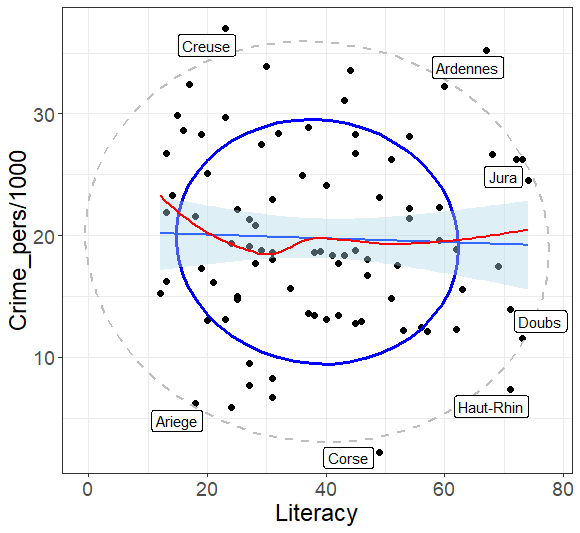

# ggplot2: Labeling noteworthy points in scatterplots (`geom_noteworthy`)

An important feature of graphical methods for datavis is automatic labeling of unusual or "noteworthy" points
in scatterplots. This is handled automatically in base R for `plot(model)`, and much more generally in the
`car` package, where an `id = list(n, method, ...)` argument to many functions provides for most use cases
via a function `car::showLabels()`. 

I use this extensively in my packages, e.g, `heplots::cqplot()`, which produces chisquare QQ plots for a multivariate
linear model,

```
library(heplots)
iris.mod <- lm(as.matrix(iris[,1:4]) ~ Species, data=iris)
cqplot(iris.mod, id.n=3)
```

Correct me if I'm wrong, but I do not find any similar facility for **easily** labeling points selectively in statistical
applications of `ggplot`.

For a simple ggplot example, I want to plot `Crime_pers` against `Literacy` in the `Guerry` data, and label those
departments which are extreme in terms of Mahalanobis distance



The basic plot, with data ellipses:

```
library(ggplot2)
data(Guerry, package="Guerry")

ggplot(aes(x=Literacy, y=Crime_pers/1000), data=Guerry) +
  geom_point(size=2) +
  stat_ellipse(level=0.68, color="blue", linewidth=1.2) +  
  stat_ellipse(level=0.95, color="gray", linewidth=1, linetype=2) + 
  geom_smooth(method="lm", formula=y~x, fill="lightblue") +
  geom_smooth(method="loess", formula=y~x, color="red", se=FALSE) +
  theme_bw() + theme(text = element_text(size=18))

gp <- last_plot()
```

Then, this is what I had to do to add the point labels:
From `qchisq(0.9, df=2) = 4.6` I had to create a separate dataset `gdf`, 
and then subset that using `gdf[gdf$dsq > 4.6,]`

```
#' ## Use Mahalanobis Dsq to label unusual points
gdf <- Guerry[, c("Literacy", "Crime_pers", "Department")]
gdf$dsq <- heplots::Mahalanobis(gdf[, 1:2])

library(ggrepel)
gp + 
	   geom_label_repel(data = gdf[gdf$dsq > 4.6,], aes(label=Department))
```

What I'm looking for is something like a `geom_noteworthy()` function. It provides similar methods to select points to be
identified in a plot, and a `geom` argument that controls how the identified points are labeled in a plot. Something like:

```r
geom_noteworthy(method = c("dsq", "mahal", "x", "y", "r", "ry"),
                n =            # number of points to label,
                geom =         # e.g.,   "text", "label", "repel",
                ...)           # other args, passed to the geom
```

To this end, in the latest release (v 1.7.4) of `heplots`
I've written a `compute` function, `heplots::noteworthy(x, y, n, method, ...)` that tries to be very general,
https://github.com/friendly/heplots/blob/master/R/noteworthy.R.

The `method` argument can be any of the following:
 * a vector of row numbers: all are chosen
 * a vector of length(x) numbers: the largest n are chosen, e.g., `cooks.distance(model)`
 * a text string:  'x', 'y', 'mahal', 'dsq', 'r', 'ry'

It returns the row IDs of the selected points

```
ids <- noteworthy(Guerry$Literacy, Guerry$Crime_pers, method = "mahal", n = 7) |> print()
# [1]  7 21 66 86  8 23 37
Guerry[ids, c("Literacy", "Crime_pers", "Department")]
#    Literacy Crime_pers Department
# 7        67      35203   Ardennes
# 21       23      37014     Creuse
# 66       71       7343  Haut-Rhin
# 86       49       2199      Corse
# 8        18       6173     Ariege
# 23       73      11560      Doubs
# 37       73      26221       Jura
```

If I had a `geom_noteworthy()`, I could simply do something like:

```
gp + geom_noteworthy(aes(label=Department), method="mahal", geom="repel", n=7)
```
